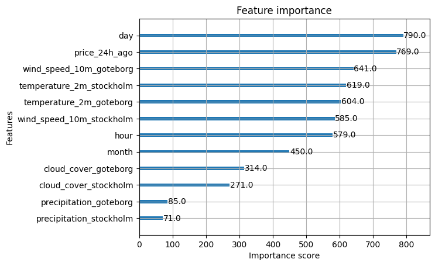

# ID2223 Project Electricity Price Predictor

The collaborators for this project are Nils Wiebe Werner and Oliver Westfahl Knezevic, the dashboard can be found here: [https://wwmachine.github.io/ID2223ProjectElectricityPricePredictor/](https://wwmachine.github.io/ID2223ProjectElectricityPricePredictor/). The pipeline- and implementation structure is inspired by the laboration 1 in this course ID2223.

This project is a scheduled price predictor of electricity prices, specifically in the SE3 area of Sweden, based mainly on weather data and the prices 24h ago as well as specifics surrounding the day of the week, month and time of the day. The SE3 area mainly covers the central-south region, excluding the very southern area, and importantly includes Stockholm as well as Gothenburg. It is therefore a major hub with large demand, causing prices to spike above other areas (mainly the northern ones). It is a stateful workflow containing four separate pipelines for the different functionalitites.

The overall architecture is divided into four separate pipelines:

1) Backfill pipeline to take in historical data and create our features through this data to insert into our Feature Store on Hopsworks.
2) Daily update pipeline to update this Feature Store on a daily schedule.
3) Training pipeline, in which training data is taken from this Feature Store and the model creation and training itself occurs. This model is then pushed onto Hopsworks, which means that this pipeline is not necessary to use for the scheduled daily updates.
4) Inference pipeline which given the model as well as features on the Feature Store does inference. The model predicts hourly electricity prices on a daily schedule for one day forward. Both hindcasts and forecasts are produced and saved in this pipeline.

# Features
Firstly, the backfill pipeline is part of the theoretical overarching feature pipeline, fetching the historical data to set up the necessary features for the training. The second notebook is the secondary part of the feature pipeline, but this part handles the scheduled daily updating of data that is necessary for inference. Both of these notebooks, that make up the feature pipeline, make use of the Hopsworks Feature Store to create the Feature Groups that store the features as well as data that is to be used between both training and inference. 

The independent variables concerning weather conditions are taken from Open-Meteo based on stations in the areas of Stockholm and Gothenburg themselves. Important to notice is however that much of the electricity consumed in these metropolitan hubs was created elsewhere, where the weather conditions likely differed greatly. Thus, the weather features concern the possibility of predicting price based on how the demand and consumption on energy will be affected by the weather, rather than the supply and creation of it.

Furthermore, the model takes the electricity price measured exactly 24h ago into consideration. Additional features concerning electricity prices were explored, e.g. prices for the last few hours or different rolling averages, but the model ended up largely depending on these and predictions flattened out. With the 24h difference in mind as well as the specifics of the day of the week and hour of the day, the model may find short cyclical patterns easier instead of just copying the previously predicted hour without logical daily differences in mind.

The data comes from two sources (with three different API endpoints in total), firstly the weather data is as previously mentioned taken from Open-Meteo through their Historical Weather API ([https://open-meteo.com/en/docs/historical-weather-api](https://open-meteo.com/en/docs/historical-weather-api)) as well as Weather Forecast API ([https://open-meteo.com/en/docs](https://open-meteo.com/en/docs)). This API gives us information regarding the temperature, windspeed, cloud coverage and precipitation in the Stockholm and Gothenburg areas. 

Secondly, the electricity prices are taken from "Elpriset just nu.se", and their "Elpris API" ([https://www.elprisetjustnu.se/elpris-api](https://www.elprisetjustnu.se/elpris-api)). It is another open-source and free API made to give information regarding electricity prices without complications, once again in JSON format. This API gives us the information needed to both backfill and train our model, as well as updating daily to enable hindcasting while doing inference and forecasting.

Below we can see the feature importance charts:

As can be seen in this chart, the model considers the day of the week to be of most importance in combination with the price 24h ago. These two variables specifically show weekly cyclic patterns, which could be crucial since electricity demand may change drastically between sunday and monday mornings for example. In addition to this, the reason for the "hour" feature having less importance may be due to the price 24h ago, which is effectively a more powerful proxy for the hour of the day. The price exactly one day ago both gives the model information regarding daily shapes, as well as the magnitude of these. 

Another interesting difference is between the precipitation and cloud coverage as opposed to the wind speeds and temperature. While wind speeds affect the supply of electricity through wind power, the cloud coverage feature is less important due to the lower mix of solar power. Temperature is similarly more important than precipitation since it more directly says something about the demand on electricity. The temperature more directly relates to demand on electricity through the need of reglating or adapting to said temperature. It could rain, and potentially cause colder temperatures, but the readings of the thermometer is a more direct measurement.

# Training and inference
Secondly, we have the training pipeline itself. In this part we use the XGBoost Regressor from the xgboost Python package as our base model architecture considering its strong proven performance. For metrics we simply chose the Mean Squared Error (MSE) and R2 score from the sklearn.metrics package for its ease of interpretability and broad use. 

We use offline batch training considering the relatively low resources needed to train the model, it is a non factor for our project, and mainly the stability of the model that comes with this approach. A good amount of historical data is available and the conditions for it were deemed stable/consistent enough for our project. Keeping the big picture in mind and not getting lost in short current changes in electricity pricing was seen as important. It is more about the larger cyclical nature of electricity demand.

Thirdly, and lastly, we have the inference pipeline that once again makes use of a batch approach with scheduled updates to hind- and forecasts each day. It is a stateful approach using Hopsworks to pull daily updated feature data from the Feature Store.

